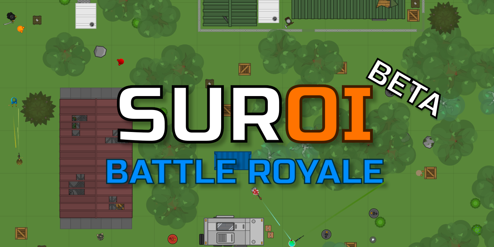

<div align="center">
  
  <hr>
</div>

<div align="center">
  
  
  
  
  
  
  
  
</div>

# Suroi Zombie Mode - Independent Project

## About
**This is an independent personal project** based on Suroi game mechanics with custom zombie mode implementation. This project is **NOT affiliated** with the original Suroi game or HasangerGames.

### Features
- 🧟 **Zombie Mode Gameplay**: Unique zombie survival mechanics
- 🤖 **AI-Powered Zombies**: Advanced AI behavior system
- 🔄 **Evolution System**: Dynamic zombie evolution mechanics
- 🎮 **Custom Game Mechanics**: Enhanced gameplay features
- 🛠️ **VS Code Extension**: Development tools and snippets

### Important Notice
This project is developed independently for **personal use and learning purposes only**. It uses Suroi's open-source codebase as a foundation but includes significant custom modifications and is not connected to the original project.

**Note**: This is a personal hobby project. No donations, contributions, or commercial use intended.

## Installation and setup
Start by installing [Node.js](https://nodejs.org). If you're running macOS or Linux, [nvm](https://github.com/nvm-sh/nvm) is recommended for ease of installation.

Once Node is installed, pnpm can be installed using the following command:
```sh
npm i -g pnpm
```
Alternatively, pnpm can be installed from [the official website](https://pnpm.io).

Next, install [Git](https://git-scm.com/), and use the following command to clone this independent project:
```sh
git clone https://github.com/thanhcy845/suroi-zombie-mode.git
```
You can also [click here to download the repo](https://github.com/thanhcy845/suroi-zombie-mode/archive/refs/heads/master.zip) and extract the files.

If you used Git, enter the newly created directory with this command:
```sh
cd suroi-zombie-mode
```

Finally, run this command in the project root to install dependencies:
```sh
pnpm install
```

## Development
To start the game locally, run the following command in the project root:

```sh
pnpm dev
```
Or, to see output from the server and client separately, you can use the `pnpm dev:server` and `pnpm dev:client` commands. (Both must be running simultaneously for the game to work.)

To open the game, go to http://127.0.0.1:3000 in your browser.

## Production
To build for production, run this command in the project root:
```sh
pnpm build
```
The server and client can be built separately using the `pnpm build:server` and `pnpm build:client` commands.

To start the game server, run this command:
```sh
pnpm start
```

Production builds are served using [NGINX](https://nginx.org).

## 🧟 Zombie Mode Features

### 🤖 **AI System**
- **Advanced Pathfinding**: A* algorithm for intelligent navigation around obstacles
- **Player Tracking**: Zombies actively hunt the nearest human player
- **Collision Avoidance**: Smart obstacle detection and avoidance
- **Behavioral States**: Different AI states (hunting, wandering, attacking)
- **Performance Optimized**: Efficient AI processing for multiple zombies

### 🎯 **Gameplay Mechanics**
- **Auto-Activation**: Zombies spawn automatically in solo mode with 1 player
- **15-Second Delay**: Grace period for player preparation before zombie spawn
- **Progressive Difficulty**: Increasing zombie spawn rate and count over time
- **Multiple Zombie Types**: Different variants with unique stats and behaviors
- **Survival Focus**: Endless waves with resource management challenges

### 🔧 **Technical Implementation**
- **Server-Side AI**: All zombie logic runs on the game server
- **Real-Time Updates**: Smooth zombie movement and behavior synchronization
- **Configurable Settings**: Adjustable spawn rates, types, and difficulty
- **Debug Tools**: Built-in testing and diagnostic utilities
- **Comprehensive Logging**: Detailed system monitoring and performance tracking

### 🧟‍♂️ **Zombie Types**
- **Basic Zombie**: Standard speed and health, balanced threat
- **Fast Zombie**: High speed, lower health, quick attacks
- **Tank Zombie**: High health, slow movement, heavy damage
- **Swarm Zombie**: Spawns in groups for overwhelming pressure

### 🎮 **How to Play Zombie Mode**
1. **Start the Game**: Open browser to `http://localhost:3000`
2. **Select Solo Mode**: Click "Chơi đơn" (Solo mode)
3. **Join Game**: Click "Tải trọng" to enter the match
4. **Prepare**: Use the 15-second grace period to gather supplies
5. **Survive**: Fight off endless zombie waves and survive as long as possible!

### 🛠️ **Testing & Debugging**
```bash
# Run zombie system tests
cd server && node zombie-system-test.js

# Run zombie diagnostics
cd server && node zombie-diagnostics.js

# Test zombie AI behavior
cd server && node test-zombie.js
```

### VS Code Extension
This project includes a custom VS Code extension for development:
- Zombie behavior snippets
- AI configuration templates
- Game mechanics helpers

## License & Credits
This independent project is based on the open-source Suroi codebase. All zombie mode features, AI systems, and custom mechanics are original implementations.

**Original Suroi**: Created by HasangerGames
**Zombie Mode Implementation**: Independent development project

## Disclaimer
This project is not affiliated with, endorsed by, or connected to the original Suroi game or HasangerGames. It is an independent educational and personal project.
