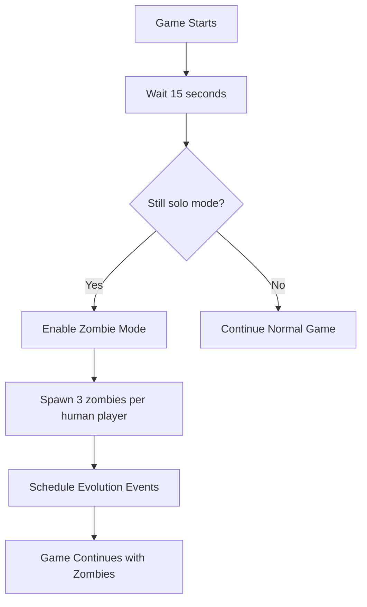
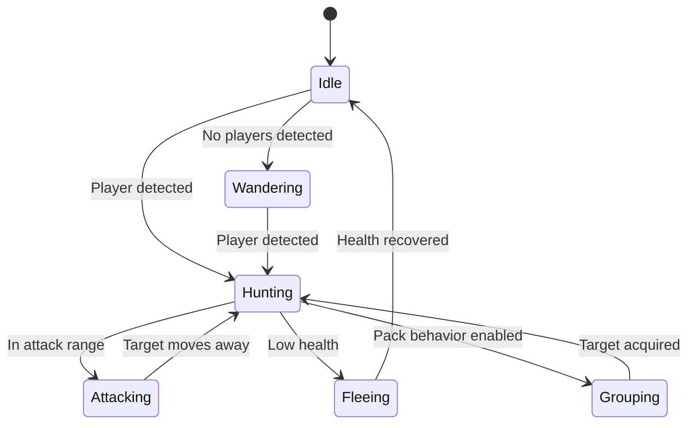

# Suroi Zombie Mode Enhancement - Complete Documentation

## Table of Contents

1. [Overview](#overview)
2. [Architecture](#architecture)
3. [Implementation Details](#implementation-details)
4. [API Reference](#api-reference)
5. [Configuration](#configuration)
6. [Development Guide](#development-guide)
7. [Troubleshooting](#troubleshooting)

## Overview

The Suroi Zombie Mode Enhancement adds AI-controlled zombies to solo matches when there aren't enough players, creating an engaging PvE experience while maintaining the core battle royale mechanics.

### Key Features

- **Automatic Activation**: Triggers after 15 seconds if only 1 player in solo mode
- **3 Zombie Types**: Each with unique stats and behaviors
- **Evolution System**: Zombies become stronger every 3 minutes
- **Advanced AI**: Pathfinding, targeting, pack behavior, and tactical positioning
- **Minimal Codebase Changes**: Designed to integrate seamlessly with existing systems

## Architecture

### Core Components

```
Zombie System Architecture
├── ZombieManager          # Spawning, evolution, lifecycle management
├── ZombiePlayer          # AI-controlled player entities
├── ZombieAI              # Behavior, pathfinding, decision making
└── ZombieTypes           # Type definitions and configurations
```

### Integration Points

- **Game.ts**: Game start logic, zombie mode activation
- **Player.ts**: Base player class with zombie flag
- **GameManager.ts**: No changes required
- **Client**: No changes required (zombies appear as regular players)

## Implementation Details

### Zombie Spawning Flow



### AI State Machine



### Evolution Timeline

| Time | Evolution Level | Health Multiplier | Speed Multiplier | Damage Multiplier |
|------|----------------|-------------------|------------------|-------------------|
| 0-3 min | 0 | 1.0x | 1.0x | 1.0x |
| 3-6 min | 1 | 1.3x | 1.2x | 1.4x |
| 6-9 min | 2 | 1.6x | 1.4x | 1.8x |
| 9+ min | 3 | 2.0x | 1.7x | 2.3x |

## API Reference

### ZombiePlayer Class

```typescript
class ZombiePlayer extends Player {
    readonly isZombie: boolean;
    readonly zombieType: ZombieTypeDefinition;
    readonly ai: ZombieAI;
    
    // Evolution
    evolve(multiplier: number): void;
    getEvolutionMultiplier(): number;
    
    // Combat
    getZombieDamage(): number;
    getDetectionRange(): number;
    getAttackRange(): number;
    zombieAttack(target: Player): void;
}
```

### ZombieManager Class

```typescript
class ZombieManager {
    // Spawning
    spawnZombiesForMatch(humanPlayerCount: number): void;
    spawnZombie(position?: Vector): ZombiePlayer | undefined;
    
    // Management
    removeZombie(zombie: ZombiePlayer): void;
    cleanup(): void;
    
    // Statistics
    getStats(): ZombieStats;
}
```

### ZombieAI Class

```typescript
class ZombieAI {
    // Core
    update(): void;
    getCurrentState(): AIState;
    
    // Events
    onTakeDamage(source: Player): void;
    onEvolution(multiplier: number): void;
    
    // State Management
    private setState(newState: ZombieAIState, target?: Player): void;
}
```

### ZombieTypes Configuration

```typescript
interface ZombieTypeDefinition {
    readonly idString: string;
    readonly name: string;
    readonly health: number;
    readonly speed: number;
    readonly damage: number;
    readonly attackRange: number;
    readonly detectionRange: number;
    readonly skin: string;
    readonly evolutionLevel: number;
    readonly aggressionLevel: number;
    readonly packBehavior: boolean;
}
```

## Configuration

### Zombie Type Customization

```typescript
// In zombieTypes.ts
export const ZombieTypes = ObjectDefinitions.create<ZombieTypeDefinition>()(
    {
        idString: "custom_zombie",
        name: "Custom Zombie",
        health: 150,           // Base health
        speed: 1.2,           // Movement speed multiplier
        damage: 35,           // Base damage
        attackRange: 3.0,     // Attack range in units
        detectionRange: 18,   // Detection range in units
        skin: "custom_skin",  // Player skin to use
        evolutionLevel: 0,    // Starting evolution level
        aggressionLevel: 0.7, // AI aggression (0-1)
        packBehavior: true    // Whether to group with other zombies
    }
);
```

### AI Behavior Tuning

```typescript
// In zombieAI.ts
export const ZombieAIConstants = {
    pathfindingUpdateInterval: 500,  // AI update frequency (ms)
    targetSwitchCooldown: 2000,     // Min time between target switches
    wanderRadius: 20,               // Random movement radius
    stuckThreshold: 1.0,            // Distance to consider "stuck"
    stuckTimeout: 3000,             // Time before unstuck behavior
    groupRadius: 10,                // Pack behavior radius
    fleeHealthThreshold: 0.2,       // Health % to start fleeing
    aggroTimeout: 10000             // Aggression duration after damage
};
```

### Game Integration Settings

```typescript
// In game.ts
private _zombieModeEnabled = false;
private _zombieSpawnTimeout?: Timeout;

// Zombie spawn timing
private scheduleZombieSpawning(): void {
    this._zombieSpawnTimeout = this.addTimeout(() => {
        // Spawn logic
    }, 15000); // 15 second delay
}
```

## Development Guide

### Creating Custom Zombie Types

1. **Define the Type**:
```typescript
// Add to zombieTypes.ts
{
    idString: "berserker_zombie",
    name: "Berserker Zombie",
    health: 180,
    speed: 1.4,
    damage: 45,
    attackRange: 2.5,
    detectionRange: 25,
    skin: "military_vest",
    evolutionLevel: 0,
    aggressionLevel: 0.9,
    packBehavior: false
}
```

2. **Create Custom Class** (Optional):
```typescript
export class BerserkerZombie extends ZombiePlayer {
    private rageMode = false;
    
    constructor(game: Game, position: Vector) {
        super(game, ZombieTypes.fromString("berserker_zombie"), position);
    }
    
    override damage(params: any): void {
        super.damage(params);
        
        // Enter rage mode when damaged
        if (this.health / this.maxHealth < 0.5) {
            this.enterRageMode();
        }
    }
    
    private enterRageMode(): void {
        if (this.rageMode) return;
        
        this.rageMode = true;
        this.speed *= 1.5;
        this.ai.onEvolution(1.3); // Boost AI aggression
    }
}
```

### Adding Custom AI Behaviors

```typescript
// In zombieAI.ts
export enum ZombieAIState {
    // ... existing states
    Berserk,
    Stalking
}

private handleBerserkState(): void {
    const nearestPlayer = this.findNearestPlayer();
    
    if (nearestPlayer) {
        // Aggressive direct charge
        this._targetPosition = nearestPlayer.position;
        this.setState(ZombieAIState.Attacking, nearestPlayer);
    } else {
        this.setState(ZombieAIState.Hunting);
    }
}
```

### VSCode Extension Usage

1. **Install Extension**: Follow setup guide
2. **Use Snippets**: Type `zombie-` and use autocomplete
3. **Quick Commands**: `Ctrl+Shift+P` → "Suroi Zombie" commands
4. **Auto-completion**: Automatic imports and type hints

### Testing Your Changes

```typescript
// In your test file
import { runQuickZombieTest } from "./zombies/zombieTests";

// Quick test
runQuickZombieTest(game);

// Full test suite
const testSuite = new ZombieTestSuite(game);
await testSuite.runAllTests();
```

## Troubleshooting

### Common Issues

**Zombies Not Spawning**
- Verify game is in solo mode (`TeamMode.Solo`)
- Check 15-second timer completion
- Ensure `minTeamsToStart` is set to 1

**AI Behaving Strangely**
- Check pathfinding grid initialization
- Verify target detection ranges
- Review AI state transitions in console

**Performance Issues**
- Reduce zombie spawn ratio
- Increase AI update intervals
- Monitor server tick rate

**Evolution Not Working**
- Check evolution timeout scheduling
- Verify multiplier calculations
- Ensure zombies aren't being recreated

### Debug Commands

```typescript
// Console commands for debugging
game.zombieManager.getStats()           // Get zombie statistics
game.zombieManager.spawnZombie()        // Manually spawn zombie
game.zombieManager.evolveAllZombies()   // Force evolution
game.zombies.forEach(z => console.log(z.ai.getCurrentState())) // Check AI states
```

### Logging

Enable detailed logging:

```typescript
// In zombieManager.ts
private debugMode = true;

private log(message: string): void {
    if (this.debugMode) {
        console.log(`[ZombieManager] ${message}`);
    }
}
```

## Performance Considerations

### Optimization Tips

1. **Reduce AI Update Frequency**: Increase `pathfindingUpdateInterval`
2. **Limit Zombie Count**: Adjust spawn ratio based on server capacity
3. **Optimize Pathfinding**: Use simpler algorithms for distant targets
4. **Batch Operations**: Group zombie updates together
5. **Memory Management**: Clean up dead zombies promptly

### Monitoring

```typescript
// Performance monitoring
const startTime = performance.now();
for (const zombie of game.zombies) {
    zombie.update();
}
const endTime = performance.now();
console.log(`Zombie updates took ${endTime - startTime}ms`);
```

## Future Enhancements

### Planned Features

- **Boss Zombies**: Rare, powerful zombie variants
- **Zombie Events**: Special spawn events during matches
- **Dynamic Difficulty**: Adjust zombie strength based on player performance
- **Zombie Abilities**: Special attacks and behaviors
- **Client Integration**: Zombie-specific UI and audio

### Contributing

1. Fork the repository
2. Create feature branch
3. Implement changes with tests
4. Submit pull request
5. Update documentation

For more information, see the main Suroi repository and community Discord.
